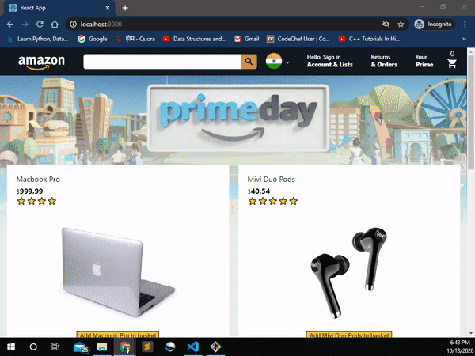

# Amazon_clone_React_JS



This is a copy of the world famous e-commerce webiste i.e.  Just tried my  skills to make real world applications, hence the original is build with 

## Key Points

- This is only the frontend and no backend used
- Not fully copied amazon as there are lots of stuff and it will takes several time
- Add to basket functionality
- Subtotal functionality
- No reloading (Power of React)
- Total Items in basket functionality

## Clone the project

```
git clone https://github.com/wouffle/Amazon_clone.git
cd amazon_clone_React_JS
npm i
npm start
```

Made with ❤️ and 
